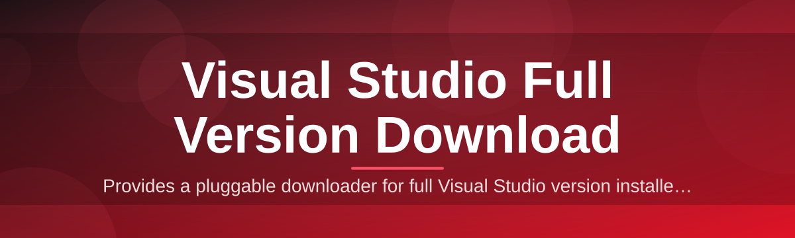

# visual-studio-full-version-manager 🧭✨

  

*One manager, every edition — get Visual Studio set up the way it should have been from the start.*

  

---

## 🔎 Overview

`visual-studio-full-version-manager` is a lightweight Windows companion built for one job: taking the friction out of getting a **Visual Studio full version download** onto a fresh machine, a build server, or a lab full of dev workstations. Instead of juggling scattered installers, mismatched bootstrappers, and half-finished setup logs, this project gives you a single, predictable entry point that understands editions, workloads, and offline layouts the way a working developer actually needs them.

It exists because setting up Visual Studio at scale is oddly harder than it should be in 2026. Component trees change between releases, offline caches balloon in size, and IT teams still get asked "which version do I even need?" more often than anyone would like to admit. This tool answers that question quietly in the background, then hands you a clean, repeatable path from zero to a fully configured IDE.

It's built for solo developers who want a no-nonsense setup, for teams standardizing dev environments across dozens of machines, and for anyone who has ever lost an afternoon to a stalled installer. If you've ever wanted your Visual Studio full version download to feel as boring and reliable as installing a text editor, this is the project for you.

## 🌱 Overview — Who It's For

> [!NOTE]
> This project is a manager and launcher layer. It orchestrates official setup packages and workload selection — it does not modify, repackage, or redistribute proprietary binaries.

 

---

## ⚡ Quick Start

| Step | What you do |
|---|---|
| 1 | Open the landing page and pick your target edition. |
| 2 | Download the manager package for Windows 10/11. |
| 3 | Run it — no admin scripts, no hidden dependencies. |

 

> [!TIP]
> First-time users should run the built-in compatibility check before selecting workloads — it saves a re-run later.

---

## 🧩 Up and Running

The table below is your map. Each capability solves a specific pain point people hit while chasing a **Visual Studio full version download** the old-fashioned way.

| Capability | What it actually does |
|---|---|
| **Edition Picker** | Presents Community, Professional, and Enterprise side by side with a plain-language diff of what each unlocks. |
| **Workload Composer** | Lets you assemble .NET, C++, game dev, or Azure workloads as modular blocks instead of one giant checkbox wall. |
| **Offline Layout Builder** | Prepares a local cache so repeat installs across machines don't re-download the same gigabytes twice. |
| **Version Ledger** | Keeps a local record of what's installed, when, and with which workloads — useful for audits and rollbacks. |
| **Silent Run Mode** | Runs setup with minimal UI for provisioning scripts and imaging pipelines. |
| **Health Check** | Scans disk space, OS build, and prerequisites before committing to a multi-gigabyte install. |
| **Update Watcher** | Flags when a newer full version is available without forcing an install. |
| **Clean Rollback** | Restores the previous configuration state if a new install introduces conflicts. |

 

<strong>Why "Full Version" instead of a slimmed-down installer?</strong>

 

Slim installers are great until you need a component that wasn't pre-selected, and then you're back online mid-project waiting on a download. The full version approach front-loads that decision so your environment is complete and predictable from day one — especially valuable for offline labs, classrooms, and CI build agents.

---

## 🚀 How to Get Started

1. Visit the project landing page linked in the button above.

2. Choose the Visual Studio edition and workload set that matches your project.

3. Launch the downloaded manager — it walks through setup with clear, numbered prompts.

4. Once installed, the Version Ledger confirms what's active and ready.

> [!IMPORTANT]
> Always run the manager from a standard user account first. Elevation prompts only appear when the actual setup step requires them — this keeps the process auditable.

---

## 🖥️ System Requirements

| Requirement | Detail |
|---|---|
| OS | Windows 10 (64-bit) or Windows 11 |
| Disk | 20–70 GB free, depending on selected workloads |
| Dependencies | None — the manager is standalone |
| Network | Required for initial download, optional afterward |
| Permissions | Standard user for setup, elevation only at install step |

 

  

---

## 🛠️ How It Works

The manager follows a short, deterministic path from launch to a working IDE — no hidden steps, no background surprises.

1. **Detect** — reads OS version, disk space, and existing Visual Studio installs.

2. **Select** — you choose edition and workloads through the composer UI.

3. **Fetch** — the manager retrieves the official setup package for the chosen configuration.

4. **Install** — setup runs with your selections applied, logged to the Version Ledger.

5. **Verify** — a post-install check confirms workloads landed correctly.

> [!NOTE]
> The Verify step is what separates this from a plain download link — it checks that every selected workload actually registered, not just that setup exited without an error.

---

## 🧯 Troubleshooting

**Q: Setup says my edition already exists but the ledger shows nothing.**
A: The ledger only tracks installs made through this manager. Run Health Check to re-scan and reconcile existing installs.

**Q: Downloaded workloads aren't showing up inside the IDE.**
A: Restart the IDE fully after install — some workloads register on next launch rather than mid-session.

**Q: The offline cache is huge and I only need it once.**
A: Disable Offline Layout Builder in settings before starting; it's opt-in for repeat-install scenarios only.

**Q: Silent Run Mode finished but nothing seems installed.**
A: Check the generated log file in the manager's working folder — silent mode suppresses UI, not logging.

**Q: Can I switch editions later without a full reinstall?**
A: Yes — the Edition Picker supports in-place upgrades between Community, Professional, and Enterprise.

**Q: Health Check flags low disk space but I have plenty free.**
A: It accounts for temporary extraction space too, roughly 1.5x the final footprint during install.

---

## 🎛️ UI / UX Details

| Element | Detail |
|---|---|
| Theme | Light and dark, follows Windows system setting by default |
| Shortcut — Search | `Ctrl + K` opens the edition/workload quick search |
| Shortcut — Health Check | `Ctrl + H` runs an on-demand system scan |
| Shortcut — Ledger | `Ctrl + L` opens the Version Ledger panel |
| Settings | Stored locally, portable via a single config file |

 

> [!TIP]
> Pin the Workload Composer view — it remembers your last configuration, which speeds up repeat setups on new machines dramatically.

---

## 🤝 Contributing & Community

Contributions are welcome, whether that's refining the workload presets, improving the Health Check heuristics, or just filing a clear bug report.

- Open an issue describing the environment and steps to reproduce.

- Keep pull requests focused — one improvement per PR is easier to review and merge.

- Discussions are open for feature ideas around new editions or workload bundles.

> [!WARNING]
> Please don't attach large binary logs directly to issues — trim to the relevant lines so maintainers can respond faster.

---

## 📄 License

Released under the [MIT License](LICENSE), 2026.

---

## ⚠️ Disclaimer

This project is an independent setup and management utility. It is not affiliated with, endorsed by, or sponsored by Microsoft. All product names, logos, and trademarks referenced belong to their respective owners. Users are responsible for complying with the applicable license terms of any software installed through this manager.

---

